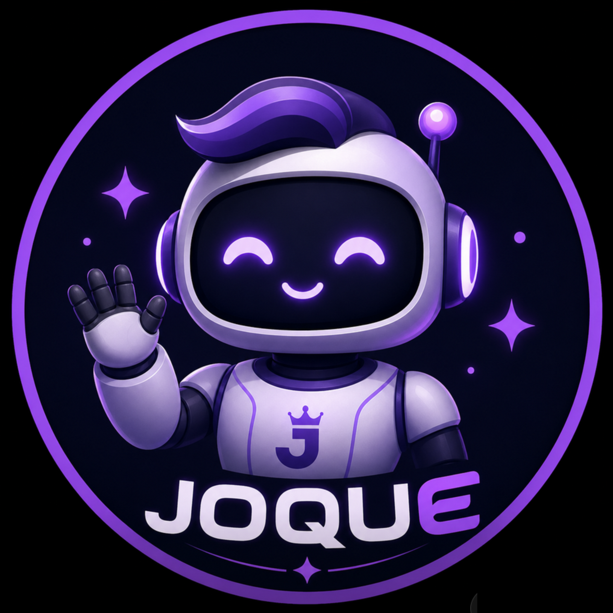
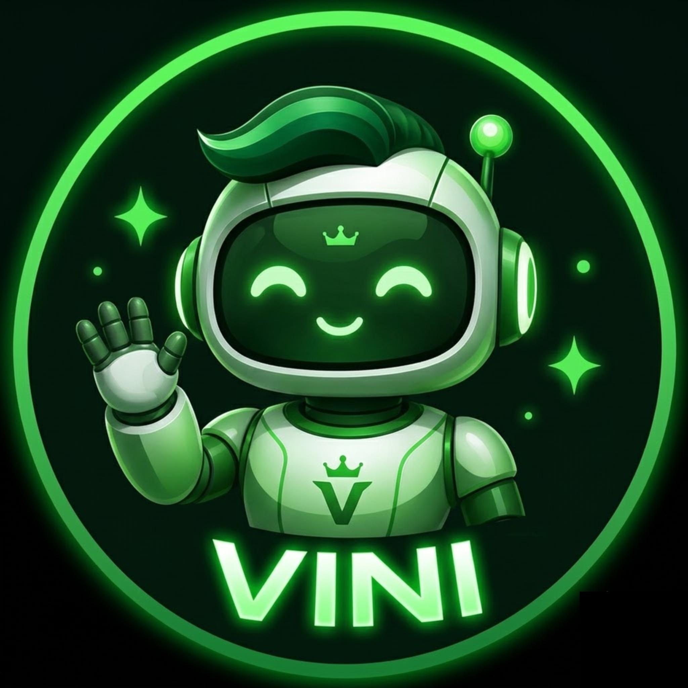

# Agentes Hermes - CIIA

Este repositório contém as configurações, personalidades (`SOUL.md`) e plugins dos agentes do CIIA para o Hermes Agent:

Todos os três agentes interagem com os usuários primariamente através do Discord:

<div align="center">

|  |  |  |
|:---:|:---:|:---:|
| **Jo** | **Larissa** | **Vini** |
| *Gestão do Conhecimento &*<br>*Integração com o Google Drive* | *Engajamento de Bolsistas* | *Comunicação & Divulgação* |

</div>

---

## Como Instalar os Agentes (Passo a Passo)

### 1. Pré-requisitos
Certifique-se de ter o **Hermes Agent** instalado no seu computador. Caso não tenha, siga as instruções oficiais de instalação do Hermes.

### 2. Clonar o Repositório e Instalar os Perfis
Abra o seu terminal e execute:

```bash
# 1. Clonar este repositório
git clone https://github.com/gus-ant/hermes_CIIA.git
cd hermes_CIIA

# 2. Dar permissão de execução ao script
chmod +x install.sh

# 3. Executar a instalação dos 3 agentes
./install.sh
```

O script criará automaticamente os perfis locais `jo`, `larissa` e `vini` na sua pasta do Hermes (`~/.hermes/profiles/`).

---

## Configuração Inicial (Variáveis de Ambiente)

Cada agente possui um arquivo secreto `.env` onde ficam guardadas as senhas e chaves de acesso. 

Para configurar o arquivo secreto de um agente, abra-o usando seu editor de código (ex: VS Code):

```bash
# Exemplo para abrir as chaves do Vini
code ~/.hermes/profiles/vini/.env
```

Dentro deste arquivo, adicione as chaves necessárias (como `OPENROUTER_API_KEY` ou `OPENAI_API_KEY`).

---

## Integração com o Discord (Acesso dos Usuários)

Para que os usuários consigam conversar com os 3 agentes (Jo, Larissa e Vini), você precisa conectar cada perfil do Hermes ao seu respectivo Bot no Discord. O processo abaixo deve ser feito individualmente para cada agente:

### 1. Criar o Bot no Portal de Desenvolvedores do Discord
1. Acesse o [Discord Developer Portal](https://discord.com/developers/applications).
2. Clique em **New Application** e dê um nome (ex: `Vini - CIIA`).
3. Vá na aba **Bot** no menu esquerdo.
4. Clique em **Reset Token** e copie o token gerado. *(Este é o seu `DISCORD_TOKEN`)*.
5. Na mesma aba **Bot**, role para baixo até **Privileged Gateway Intents** e ative as opções:
   * Presence Intent
   * Server Members Intent
   * Message Content Intent
6. Vá na aba **OAuth2** > **URL Generator**:
   * Em *Scopes*, marque `bot`.
   * Em *Bot Permissions*, marque as permissões necessárias (ex: `Administrator` ou leitura/escrita de mensagens).
   * Copie o link gerado na parte inferior, cole no seu navegador e adicione o bot ao servidor de sua preferência.

### 2. Adicionar as credenciais no .env do Agente
No arquivo `.env` do respectivo agente, adicione:
```env
DISCORD_TOKEN=seu_token_aqui
DISCORD_ALLOWED_USERS=seu_id_do_discord_123,outro_id_456
```
*(Nota: Para descobrir seu ID no Discord, ative o Modo Desenvolvedor nas configurações do Discord, clique com o botão direito no seu nome e selecione "Copiar ID")*.

### 3. Ligando o Motor (Iniciando o Gateway)
O "Gateway" é a ponte que liga o Hermes ao Discord. Se ele estiver desligado, o agente fica "offline" no Discord.

*   **Para ligar o agente pela primeira vez (ou forçar a conexão):**
    ```bash
    hermes gateway run --profile vini --force
    ```
*   **Para reiniciar o bot após mudar alguma configuração no .env:**
    ```bash
    hermes gateway restart --profile vini
    ```
*   **Para parar o bot imediatamente:**
    ```bash
    hermes gateway stop --profile vini
    ```
    *Dica:* Se der algum erro na reinicialização, execute o `stop`, **espere 10 segundos** e execute o `run` novamente.

---

## Integração com o Google Drive (Jo)

A integração com o Google Drive no perfil de **Jo** é extremamente simples porque o próprio agente ajuda você a configurá-la.

1. Inicie o Hermes no perfil do Jo:
   ```bash
   hermes --profile jo
   ```
2. Peça ajuda a ele em linguagem natural:
   > *"Jo, o que você precisa para se conectar ao meu Google Drive?"*
3. O agente explicará o passo a passo, solicitará o arquivo de credenciais JSON (Service Account ou OAuth Client) e fará a instalação das dependências e a configuração de forma autônoma!

---

## Solução de Problemas Comuns

| Erro / Mensagem | O que significa? | Como resolver? |
| :--- | :--- | :--- |
| `discord.errors.LoginFailure: Improper token...` | O token do Discord está incorreto ou desatualizado. | Confira o token no arquivo `.env` e execute `hermes gateway restart --profile vini`. |
| `Unauthorized user` | Você tentou falar com o bot no Discord, mas ele não reconheceu seu ID. | Verifique se seu ID do Discord está adicionado na variável `DISCORD_ALLOWED_USERS` no `.env`. |
| `Opus codec not found` | Falta um arquivo de codecs de áudio no sistema. | Pode ignorar! Isso só afeta recursos de voz; o envio de mensagens de texto funcionará perfeitamente. |

---

## Dicionário de Comandos Essenciais

Guarde esta tabela. Ela é o seu mapa para lidar com o terminal no dia a dia dos agentes:

| O que você quer fazer | Comando no Terminal |
| :--- | :--- |
| Entrar em um agente específico via CLI | `hermes -p nome_do_agente` |
| Abrir as instruções de personalidade do robô | `code ~/.hermes/profiles/nome_do_agente/SOUL.md` |
| Abrir o arquivo secreto de chaves/tokens | `code ~/.hermes/profiles/nome_do_agente/.env` |
| Reiniciar a conexão com o Discord | `hermes gateway restart --profile nome_do_agente` |
| Ver o logs/diário do robô em tempo real | `tail -f ~/.hermes/profiles/nome_do_agente/logs/gateway.log` |
| Verificar se o token do Discord é válido | `curl -H "Authorization: Bot SEU_TOKEN" https://discord.com/api/v10/users/@me` |

---

## Economia de Tokens e Otimização de Custos

Manter agentes rodando continuamente (especialmente em plataformas como o Discord) pode consumir muitos tokens caso não haja um controle. O Hermes possui ferramentas nativas em seu `config.yaml` para otimizar esse consumo:

### 1. Compressão Automática de Contexto
A compressão resume conversas longas de forma automática. Ela usa um modelo mais leve para gerar resumos do histórico intermediário, liberando espaço de contexto.
Ajuste os parâmetros no `config.yaml` de cada agente:
```yaml
compression:
  enabled: true
  threshold: 0.50       # Ativa a compressão ao atingir 50% do limite do modelo
  target_ratio: 0.20    # Mantém 20% do limite reservado para as mensagens recentes
  protect_last_n: 20    # Mantém as últimas 20 mensagens totalmente intactas
```

### 2. Reinicialização Automática de Sessões
Para agentes no Discord, conversas ativas acumulam tokens rapidamente. Use o `session_reset` para limpar o contexto após inatividade ou diariamente. O Hermes salvará os aprendizados importantes na memória persistente antes de limpar o histórico.
Configure no `config.yaml`:
```yaml
session_reset:
  mode: both           # Limpa por inatividade E num horário agendado
  idle_minutes: 1440   # Zera após 24h sem interações
  at_hour: 4           # Reinicia às 4:00 da manhã
```

### 3. Prompt Caching
Se estiver utilizando modelos da Anthropic (como Claude 3.5 Sonnet), ative o cache de prompt para reutilizar instruções de sistema (`SOUL.md`) e históricos, reduzindo drasticamente o custo de leitura (input).
Configure no `config.yaml`:
```yaml
prompt_caching:
  cache_ttl: "1h"      # Mantém o cache por 1 hora
```

### 4. Controle Manual via Chat
Os usuários também podem comandar o agente diretamente na conversa para poupar recursos:
*   Use `/reset` ou `/new` para zerar o histórico da conversa e começar um assunto novo.
*   Use `/compact` para forçar a compressão do contexto imediatamente.
*   Use `/context` para visualizar o consumo atual de tokens da sessão.
